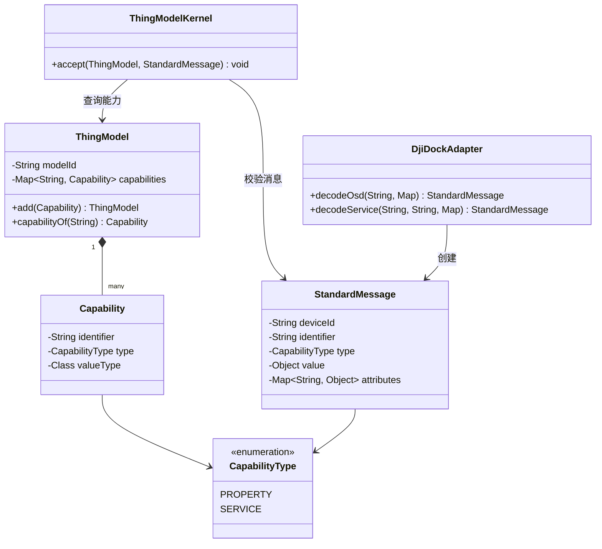
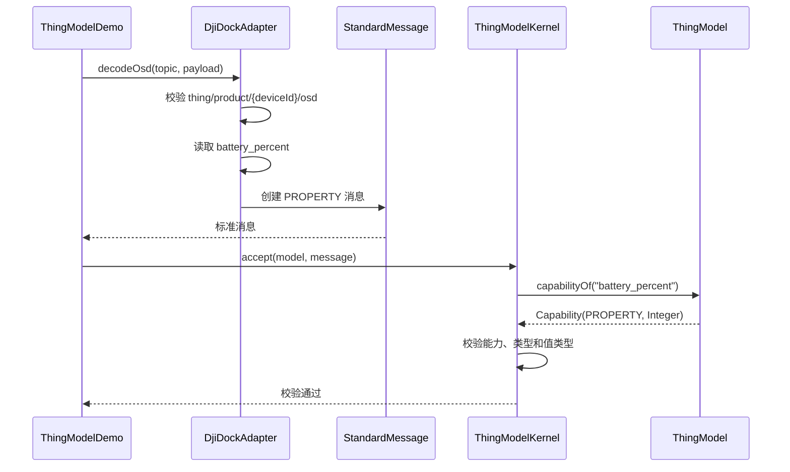
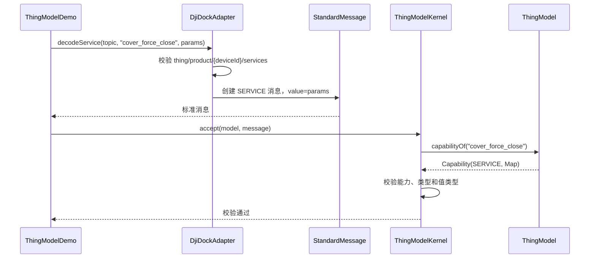
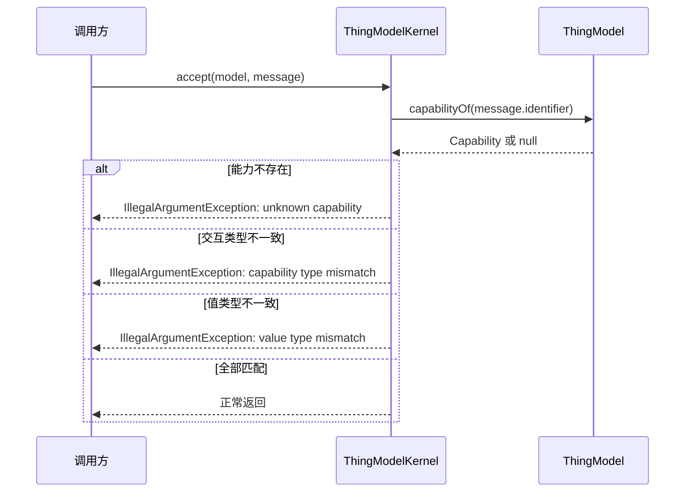

# 物模型内核设计说明

本文记录 `device-platform-thing-model` 当前已实现的最小物模型链路：厂商风格消息经协议适配后，转换为统一消息，并由物模型内核校验其合法性。

## 范围与非目标

当前模块已实现：

- 设备模型及其能力字典的内存定义；
- DJI Dock 风格的 OSD 属性和服务调用数据到统一消息的转换；
- 能力是否存在、交互类型是否匹配、载荷类型是否匹配的校验；
- 可运行的 OSD 与服务调用模拟场景。

当前模块未实现 MQTT 收发、设备连接、命令下发、服务回执、数据库持久化、设备状态投影与重试机制。示例中的 `services` Topic 仅作为适配器输入；它不表示已经完成向真实设备的下行发布。

## 核心对象关系

## 时序：OSD 属性上报

对于示例载荷，适配结果为：`deviceId=DEMO-DOCK-001`、`identifier=battery_percent`、`type=PROPERTY`、`value=72`。原始 Topic 和 `mode_code` 不成为内核字段，而是保存在 `attributes` 中（其中 `mode_code` 被命名为 `flightMode`）。

## 时序：服务调用标准化

服务参数同时作为 `value` 和 `attributes` 的基础数据；`attributes` 额外保存 `sourceTopic`，从而保留协议来源。

## 时序：拒绝不合法消息

## 类职责与设计边界

| 类 | 设计作用 | 关键约束与边界 |
| --- | --- | --- |
| `ThingModel` | 某类设备的能力字典。以 `modelId` 标识模型，以 `identifier -> Capability` 组织能力。 | 拒绝空模型 ID 和重复能力标识；对外返回不可修改的能力 Map。它描述设备类型，不保存某台设备的实时状态。 |
| `Capability` | 单项物模型能力的定义，包含标识、交互类型和允许的 Java 载荷类型。 | 不承载实际业务动作。当前类型系统为最小实现，使用 `Class<?>`，例如电量为 `Integer`、服务参数为 `Map`。 |
| `CapabilityType` | 为能力和消息提供交互语义。 | 当前仅有 `PROPERTY` 和 `SERVICE`，用于阻止属性消息被当作服务、或反向使用。事件和服务响应尚不在当前模型内。 |
| `StandardMessage` | 协议适配层进入内核的统一消息契约，包含设备、能力、类型、载荷和扩展元数据。 | 构造时校验必要字段，并复制、冻结 attributes，防止外部 Map 的后续变更影响消息；`value` 的具体类型由物模型校验。 |
| `ThingModelKernel` | 最小校验边界。依次判断能力存在、交互类型匹配、载荷运行时类型匹配。 | 不负责协议解析、路由、存储、发布、重试或状态更新；校验失败以 `IllegalArgumentException` 显式反馈。 |
| `DjiDockAdapter` | DJI Dock 风格 Topic/载荷的反腐层，将厂商字段映射为厂商无关的 `StandardMessage`。 | `decodeOsd` 固定提取 `battery_percent`，并把 `mode_code` 作为 `flightMode` 元数据保留；`decodeService` 接收调用方提供的服务标识和参数，不执行实际下行发布。 |
| `ThingModelDemo` | 场景装配入口，定义演示模型、模拟载荷，并串联适配与校验。 | 只服务于可运行示例，不应承载内核扩展；后续消息总线、状态模块应通过标准消息在独立模块接入。 |
| `ThingModelKernelTest` | 为内核的可接受和拒绝规则提供单元测试。 | 当前覆盖适配后的 OSD 正常路径及交互类型冲突路径；未知能力、值类型错误、非法 Topic 与必填字段缺失仍可继续补测。 |

## 当前模型的扩展方向

后续若接入真实消息链路，应保持 `DjiDockAdapter -> StandardMessage -> ThingModelKernel` 的稳定边界，在其外侧新增明确职责的模块，例如消息收发、状态投影或命令发布模块。不要将 MQTT、数据库或厂商协议细节堆入 `core` 包。
